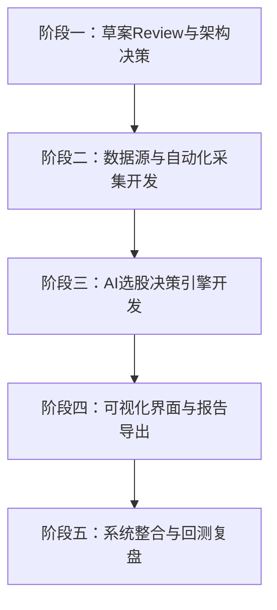

# 🗺️ 湖滨四季选股系统开发路线图 (Roadmap)

我们计划将湖滨四季自动化选股系统分为五个阶段逐步推进，确保每一步的决策和实现都具有高可靠性和可复现性。

---

## 阶段一：草案Review与架构决策 (当前阶段)
* [x] 阅读并分析原始草案《湖滨四季每日自动化选股策略skill.html》与历史选股样本。
* [ ] 针对核心模块的数据源（知识星球、龙虎榜、盘前消息面）与技术栈进行Review和决策。
* [ ] 确定AI决策Prompt框架与个股量化战法规则。

## 阶段二：数据源与自动化采集开发
* [ ] **知识星球PDF自动获取与解析**：
  * 调研知识星球API/自动化浏览器模拟下载，或开发本地文件夹监听（支持手动放入后自动解析）。
  * 开发 PDF 文字与逻辑段落提取模块。
* [ ] **龙虎榜数据抓取**：
  * 对接东方财富或同花顺等公开接口，自动化抓取每日“机构席位净买入”数据。
* [ ] **盘前利空利多扫描**：
  * 对接美股及A股实时行情接口，监控美股光通信、半导体、存储等核心板块表现。

## 阶段三：AI选股决策引擎开发
* [ ] **量化初步筛选器**：
  * 实现基于K线指标（如21日线、60日线、89日线多头排列、底部企稳、阳多阴少、流通市值等）的初步技术面过滤。
* [ ] **大模型信息合成与排除**：
  * 大模型结合盘前利空过滤排除标的。
  * 对知识星球催化逻辑进行蒸馏，匹配对应的筛选个股。
* [ ] **湖滨四季战法综合评分与介入条件生成**：
  * 设计AI评分Prompt，根据催化强度、技术面匹配度、龙虎榜买入等进行综合评分，输出首选三标及具体仓位、买入条件。

## 阶段四：可视化界面与报告导出
* [ ] **Markdown报告自动化导出**：
  * 完美契合 `examples` 中的格式，支持一键导出每日 Markdown 报表。
* [ ] **精美Web可视化UI**：
  * 构建现代化Web UI，展示每日市场环境判定、利空排除矩阵、首选个股排名及评分、历史操作总结。
  * 提供交互式复盘看板。

## 阶段五：系统整合与回测复盘
* [ ] **选股系统全流程联调测试**（落实改后必测原则）。
* [ ] **历史数据回测与Prompt调优**。
* [ ] **部署运行与每日自动化推送配置**。
